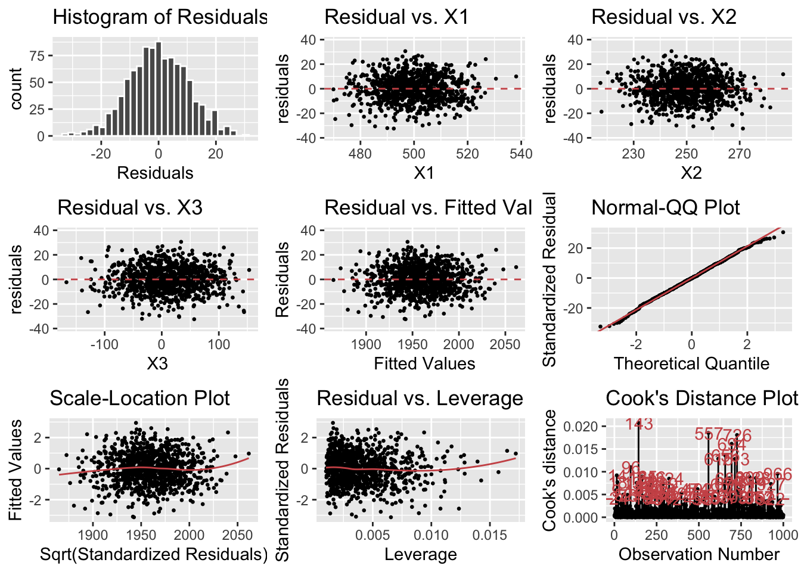
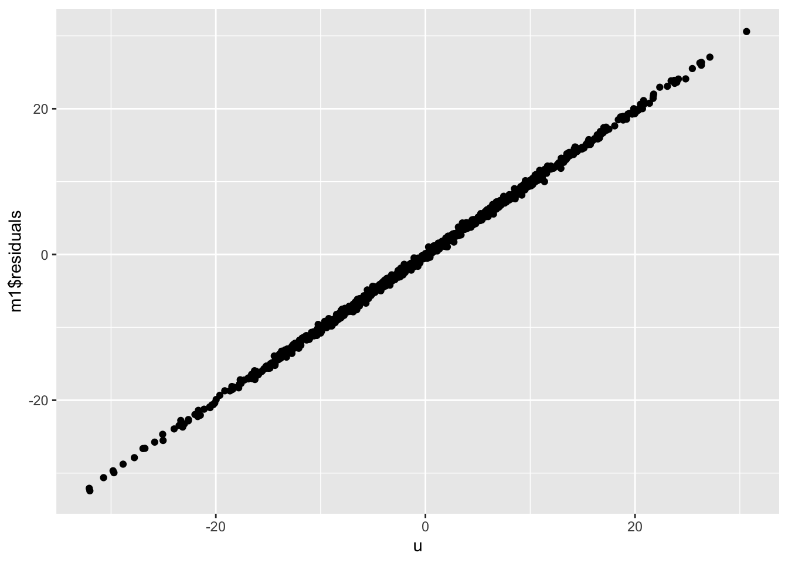

Differences of disturbance terms at the population level and residuals from multivariate OLS. 

Inspired by: 
https://github.com/Matzge/Simulation-Error-Term-and-Residuals


## TRUE MODEL


```r

set.seed(1)

X1 <- rnorm(1000, mean = 500, sd=10)

X2 <- rnorm(1000, mean = 250, sd=10)

X3 <- rnorm(1000, mean = 10, sd = 50)

u <- rnorm(1000, mean=0, sd=10)

Data <- cbind(X1,X2,X3,u)
Data <- as.data.frame(Data)
```


Creating the true model based on a deterministic function

```r
Data %<>% mutate(Y = (500 + 2.7*X1 + 0.44*X2 -0.12*X3 + u))
```


Summing and computing trhe mean of the disturbance

```r

sum(Data$u)
## [1] 167.2225
mean(Data$u)
## [1] 0.1672225
```


Modelling

```r
Data %>% lm(Y ~ X1 + X2 + X3, data=.) %>% summary()
## 
## Call:
## lm(formula = Y ~ X1 + X2 + X3, data = .)
## 
## Residuals:
##     Min      1Q  Median      3Q     Max 
## -32.427  -7.139  -0.122   7.199  30.592 
## 
## Coefficients:
##              Estimate Std. Error t value Pr(>|t|)    
## (Intercept) 484.86023   17.72691   27.35   <2e-16 ***
## X1            2.72300    0.03183   85.56   <2e-16 ***
## X2            0.45516    0.03164   14.38   <2e-16 ***
## X3           -0.11815    0.00639  -18.49   <2e-16 ***
## ---
## Signif. codes:  0 '***' 0.001 '**' 0.01 '*' 0.05 '.' 0.1 ' ' 1
## 
## Residual standard error: 10.4 on 996 degrees of freedom
## Multiple R-squared:  0.8859,	Adjusted R-squared:  0.8856 
## F-statistic:  2578 on 3 and 996 DF,  p-value: < 2.2e-16
```

Checking the residuals

```r
m1 <- lm(Y ~ X1 + X2 + X3, data=Data)
sum(m1$residuals)
## [1] 1.894734e-13
mean(m1$residuals)
## [1] 1.865747e-16
```


Diagnosing residuals

```r
gg_diagnose(m1)
## `stat_bin()` using `bins = 30`. Pick better value with `binwidth`.
## `geom_smooth()` using formula 'y ~ x'
## `geom_smooth()` using formula 'y ~ x'
```




Ploting residuals x disturbances

```r
Data <- cbind(Data, m1$residuals)
ggplot(Data) + geom_point(aes(x=u, y=`m1$residuals`))
```




that's it for today!
